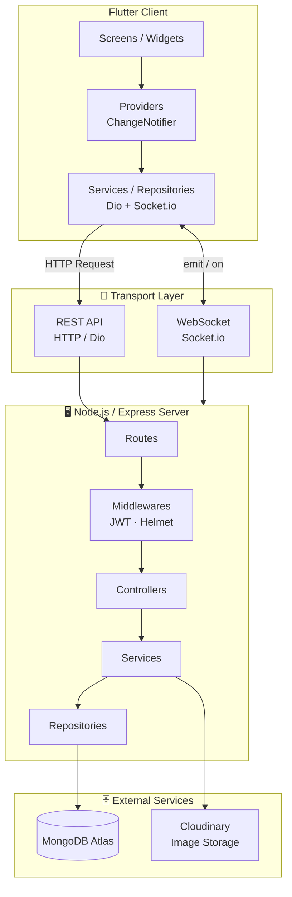

<div align="center">
  <h1>Sportty</h1>
  <p>A cross-platform mobile app for finding sports partners and managing amateur sports teams.</p>
  <p>
    
    
    
    
  </p>
</div>

## 📱 About

**Sportty** is a full-stack mobile application built with Flutter and Node.js. It connects sports enthusiasts by letting them discover nearby players, join amateur teams, and communicate in real time.

> **Built as a portfolio project** demonstrating Clean Architecture, real-time communication, and REST API design in a cross-platform mobile environment.

---

## ✨ Features

| Module | Features |
|---|---|
| **Auth** | Register, Login, JWT authentication, persistent session |
| **Profile** | View & edit profile, upload avatar via Cloudinary |
| **Discover** | Swipe-based player discovery, GPS-based nearby search |
| **1-1 Chat** | Private messaging with matched players, real-time via Socket.io |
| **Team Management** | Create teams, search teams by sport/keyword, role-based management (Captain / Member), join request flow with approval/rejection |
| **Team Chat** | Group messaging for team members, real-time via Socket.io |
| **Team Feed** | Announcements, polls, match attendance check-in (NOTICE / VOTE / MATCH_SCHEDULE) |
| **Notifications** | Real-time push notifications for team events, join requests |
| **Social Feed** | Post updates, like, comment |

---

## 🏗️ System Architecture



---

## 🛠️ Tech Stack

**Client**
- Flutter (Dart)
- `provider` — State management
- `dio` — HTTP client with interceptors
- `socket_io_client` — Real-time messaging
- `shared_preferences` — Local token storage
- `image_picker` + `cached_network_image` — Media handling
- `geolocator` — GPS location
- `flutter_card_swiper` — Swipe UI
- `google_fonts`, `flutter_svg` — UI

**Server**
- Node.js + Express.js
- MongoDB + Mongoose
- Socket.io — WebSocket server
- JWT + bcryptjs — Authentication
- Cloudinary + Multer — Image upload
- Helmet + CORS — Security
- Joi — Input validation
- Morgan — Request logging

---

## 🚀 Getting Started

### Prerequisites
- Flutter SDK `^3.10.7`
- Node.js `>=18`
- MongoDB (local or Atlas)
- Cloudinary account

### 1. Clone the repo
```bash
git clone https://github.com/YOUR_USERNAME/Sportty.git
cd Sportty
```

### 2. Setup Server
```bash
cd server
npm install

# Copy the example env and fill in your values
cp .env.example .env
```

Edit `server/.env`:
```env
PORT=3000
MONGO_URI=your_mongodb_connection_string
JWT_SECRET=your_jwt_secret_key
CLOUDINARY_CLOUD_NAME=your_cloud_name
CLOUDINARY_API_KEY=your_api_key
CLOUDINARY_API_SECRET=your_api_secret
```

```bash
npm run dev   # Start server with nodemon
```

### 3. Setup Client
```bash
cd client
flutter pub get
```

Edit `lib/core/constants/api_constants.dart` and replace with your machine's local IP:
```dart
static const String baseUrl = 'http://YOUR_LOCAL_IP:3000/api';
static const String socketUrl = 'http://YOUR_LOCAL_IP:3000';
```

```bash
flutter run
```

---

## 📡 API Overview

| Method | Endpoint | Description |
|---|---|---|
| POST | `/api/auth/register` | Register new user |
| POST | `/api/auth/login` | Login, returns JWT |
| GET | `/api/users/nearby` | Find nearby players |
| POST | `/api/swipes` | Swipe like/dislike |
| GET | `/api/matches` | Get my matches (chat list) |
| GET/POST | `/api/messages` | Get/send messages |
| POST | `/api/teams` | Create team |
| GET | `/api/teams` | Search teams |
| GET | `/api/teams/:id/messages` | Get team chat history |
| POST | `/api/teams/:id/activities` | Create team post/vote/schedule |
| GET | `/api/notifications` | Get notifications |
| GET/POST | `/api/posts` | Social feed |

---

## ⚡ Real-time Socket Events

| Event (emit) | Direction | Description |
|---|---|---|
| `join_chat` | Client → Server | Join a private chat room |
| `join_team_chat` | Client → Server | Join a team chat room |
| `join_notification` | Client → Server | Subscribe to personal notifications |
| `send_message` | Client → Server | Send private message |
| `send_team_message` | Client → Server | Send group message |
| `receive_message` | Server → Client | Receive private message |
| `receive_team_message` | Server → Client | Receive group message |
| `receive_notification` | Server → Client | Receive push notification |
| `new_activity` | Server → Client | New team feed post |
| `activity_updated` | Server → Client | Vote/attendance updated |
| `team_joined` | Server → Client | Approved to join team |

---
